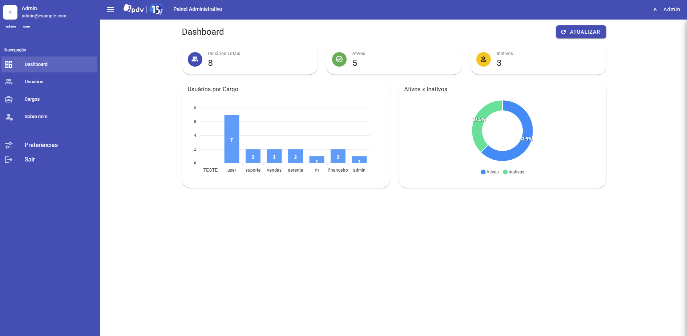

# Frontend App

## 1. Visão Geral

Esta aplicação web fornece a interface gráfica do sistema de gerenciamento de Usuários e Cargos. Foi construída com **Vue 3** (Composition API e `<script setup>`) utilizando **Vite** e **Vuetify 3** para uma UI moderna e responsiva. Pinia gerencia o estado global e Axios realiza as chamadas à API. O design é mobile‑first e acessível. Veja a aparência geral abaixo.



## 2. Arquitetura & Decisões

O código segue uma estrutura organizada que separa preocupações:

* `src/app` – temas e layout principal;
* `src/pages` – telas completas (Login, Dashboard, Usuários, Cargos);
* `src/components` – componentes reutilizáveis (formulários, tabelas, layout);
* `src/stores` – Pinia stores para autenticação, usuários e cargos;
* `src/services` – instância Axios com interceptors para JWT e refresh;
* `src/router` – rotas e guards de navegação;
* `src/styles` – estilos globais.

A decisão por Vuetify se deu pela sua vasta coleção de componentes acessíveis e prontos para mobile. As requests são centralizadas em uma instância Axios com interceptors que anexam o access token e, em caso de 401, tentam renovar o token automaticamente via refresh token.

## 3. Requisitos

* Node 16+
* PNPM ou NPM
* Docker (opcional)

## 4. Ambiente

Crie um arquivo `.env` a partir do `.env.example` e ajuste a URL da API conforme necessário:

```
VITE_API_BASE_URL=http://localhost:3333/api
```

## 5. Subindo com Docker

O frontend pode ser executado de forma independente ou acoplado ao backend. Para fins de desenvolvimento isolado, basta executar:

```bash
npm install
npm run dev
```

Opcionalmente, um `docker-compose.yml` pode ser adicionado para subir um contêiner do Vite, mas geralmente o frontend roda localmente no navegador.

## 6. Banco & Migrations

O frontend não possui banco. Todas as operações de dados são delegadas à API via Axios.

## 7. Executando

Para desenvolvimento, execute:

```bash
npm install
npm run dev
```

A aplicação estará disponível em `http://localhost:5173`. Para um build de produção:

```bash
npm run build
```

Os arquivos estáticos serão gerados em `dist/`.

## 8. Testes & Cobertura

Os testes de componentes utilizam **Vitest** e **@testing-library/vue**. Para executá‑los:

```bash
npm run test
```

A configuração de testes está em `vitest.config.js`. Esforce‑se para manter uma boa cobertura, principalmente dos formulários de login e de usuário.

## 9. Coleções de API

As chamadas à API são abstratas pelo service `src/services/api.js`, que define interceptors para tokens. A coleção completa encontra‑se em `../backend/docs/collection.json` para ser importada no Insomnia ou Thunder Client.

## 10. SQL das Tabelas

Consulte o repositório backend para o schema SQL das tabelas.

## 11. Vídeo Demo

O vídeo de demonstração apresenta o login, criação e edição de cargos, criação de usuários, vinculação de cargos, listagem filtrada, desativação, logout e fluxo de renovação de token. Inclua um link aqui para YouTube/Drive/Wetransfer conforme a sua entrega final.

## 12. Roadmap & Melhorias Futuras

* Transformar a aplicação em PWA (instalável e offline);
* Implementar tema escuro e personalização de cores;
* Internacionalização (i18n);
* Mais filtros e ordenação avançada nas tabelas;
* Componentizar ainda mais os formulários e tabelas;
* Adicionar linter/formatador em pre-commit com Husky e lint-staged;
* Testes end‑to‑end com Cypress ou Playwright.